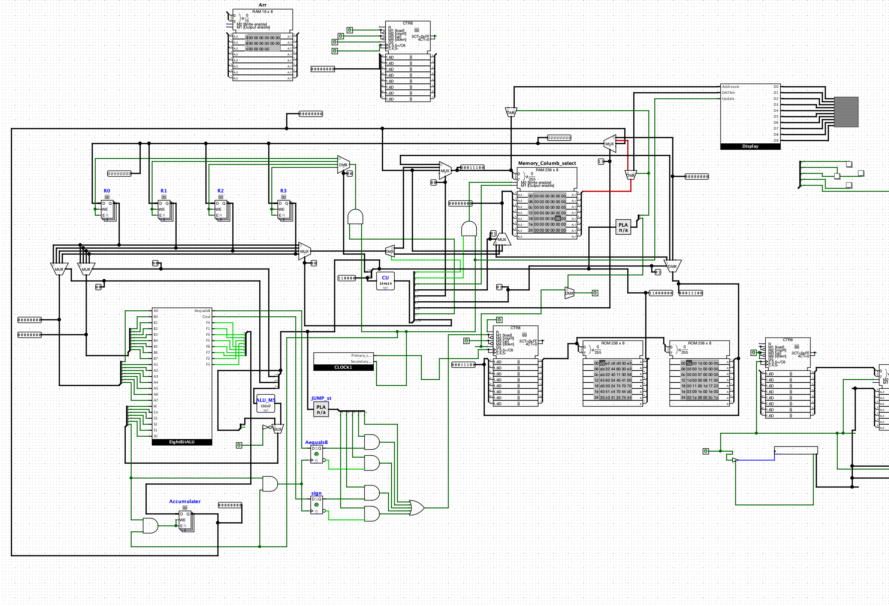
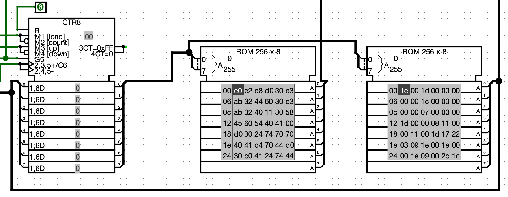
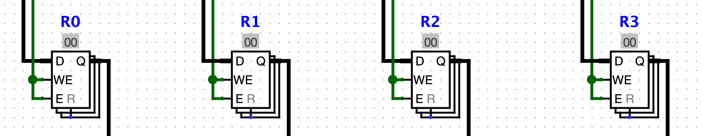
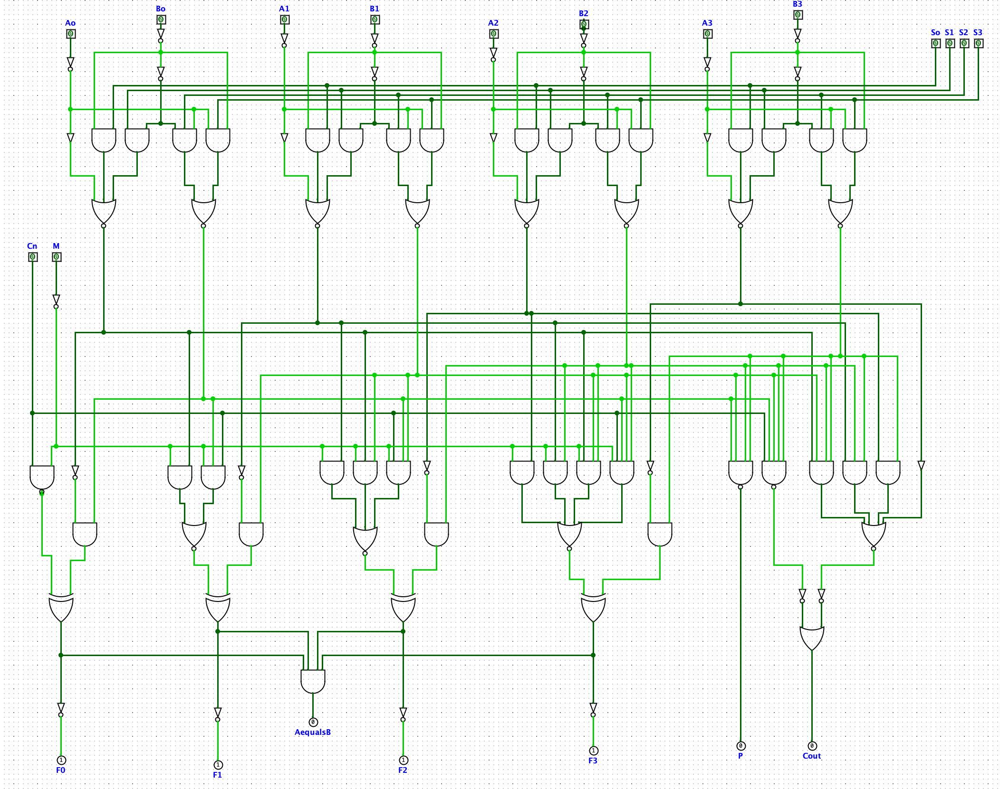
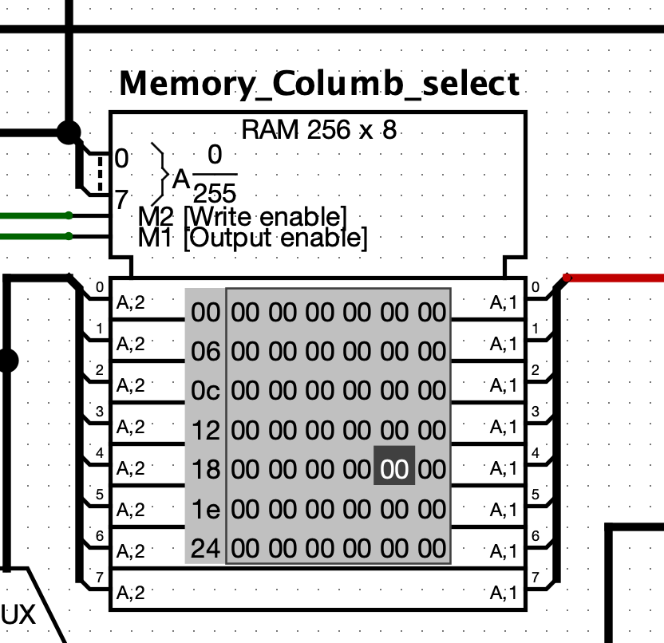
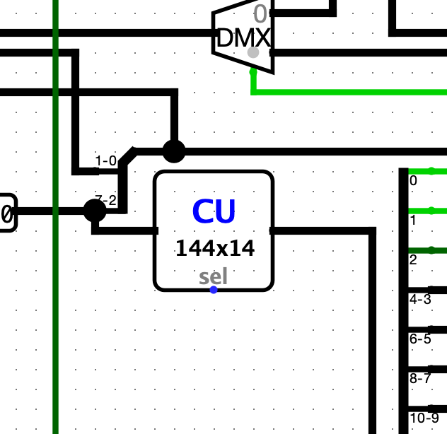

# 8-bit-cpu

This project showcases a simple 8-bit CPU built using digital logic components. It follows a Harvard Architecture, supporting basic arithmetic, logical operations, and memory interaction. Designed primarily for learning and demonstration, this CPU features custom display output, registers, RAM/ROM, and a functional ALU.

## Capabilities

- Stores up to 256 lines of instructions and data (Harvard Architecture)
- Operates at clock rates up to 128 Hz
- Supports full 8-bit arithmetic and logical operations

## Specifications

- 4 General-purpose 8-bit registers (R0–R3)
- 256-byte RAM
- Two 256-byte ROMs (for instructions and data)
- 8-bit Program Counter
- 8-bit ALU (built using two 74181 4-bit ICs)
- 10×8 pixel monochrome display output

## Component Breakdown

#### 1. Program Counter (PC) and ROM

_The Program Counter module, In this cpu PC is a normal counter with counts up when an Instructions is executed._

#### 2. General Purpose Registers (GR)

_The General Purpose Register, holding temporary data for CPU to use._

#### 3. ALU (Arithmetic Logic Unit)

_This is a 4-bit ALU based 74181IC. I have used two of these to make a 8-bit ALU._

### 4. RAM Module

_The RAM module for Temprary data storage and VRAM(data storage for display)._

<!-- #### 5. Control Unit

_The Control Unit, This decodes instructions and sets the path for data to flow._ -->

---

## Schematics / Block Diagrams
(Link to or embed your schematics here)

